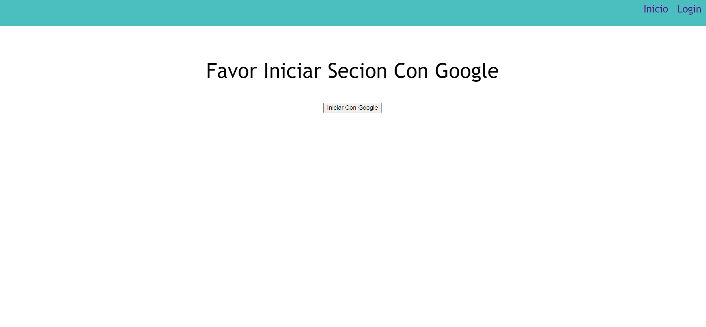
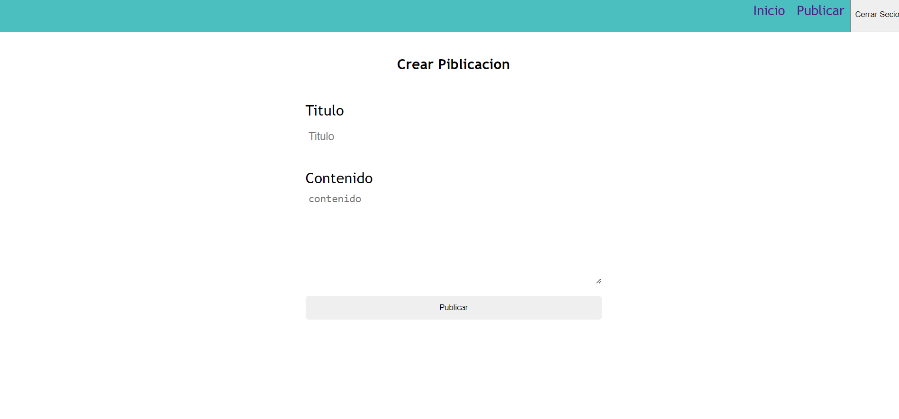

Este es el proyecto final de Dewris Sosa.
Para el correcto funcionamiento del programa se crear un proyecto
de ract e instalarle las dependencias de firebase y react-router-dom
el preyecto usa el sistema de autenticacion de Google provisto por
firebase y el sistema de base de datos provisto tambien por firebase
Aqui adjunto fotos del programa.

